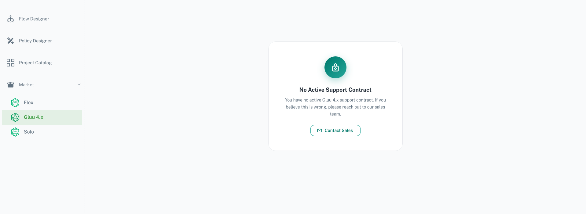
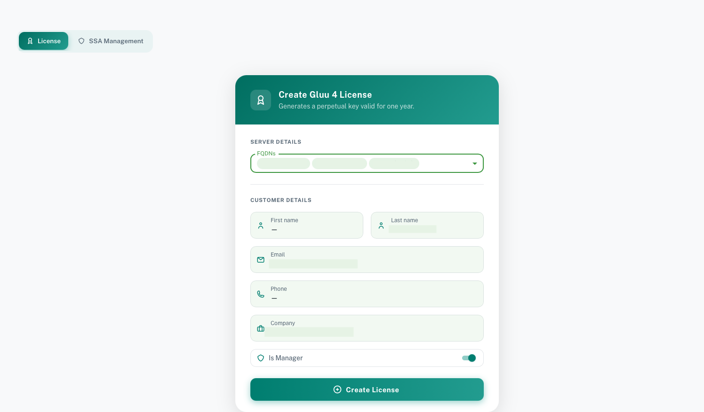
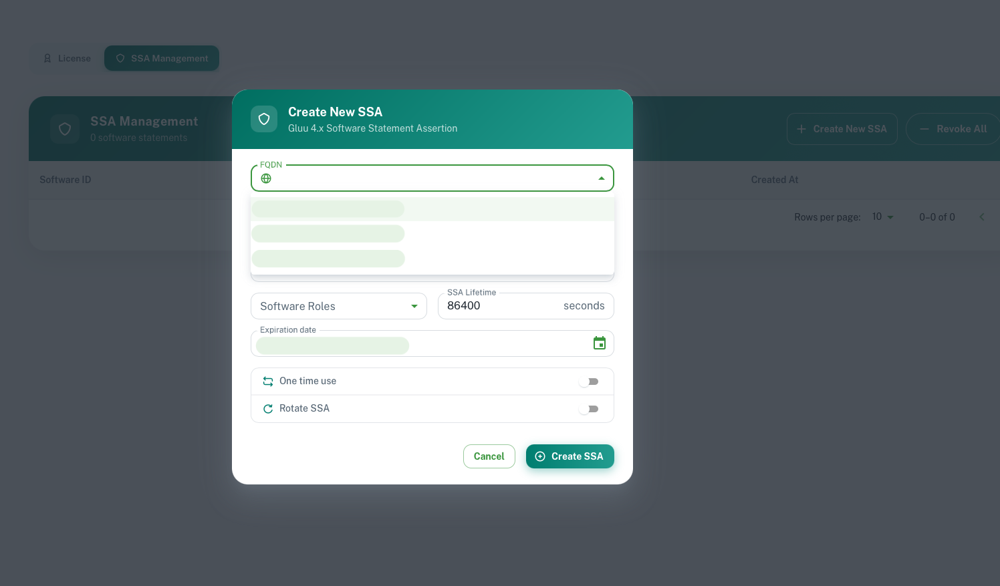
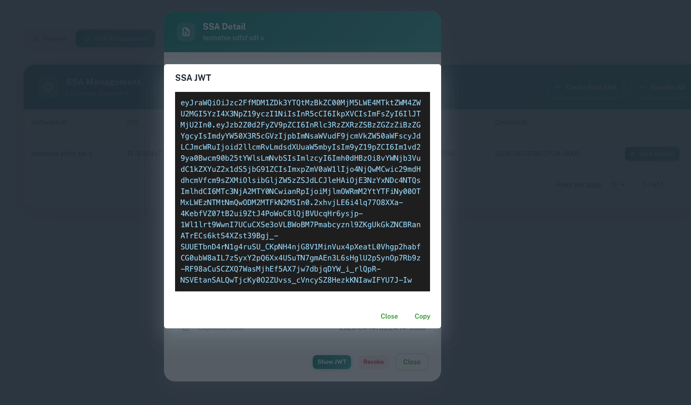

---
tags:
- administration
- installation
---
# Prerequisites

!!! warning "Important"
    Thanks for checking out Gluu4. Gluu contributed its core code to the Linux Foundation in 2020, and we chartered the Janssen Project to hold these components. Gluu 4 is our old product (pre-contribution) and is basically EOL.  Jans Auth Server has many more features and a more modern configuration layer.  Here are some recommended links to learn more:
    1. Janssen Project Docs: https://docs.jans.io
    2. [Janssen Project GitHub home](https://jans.io) (Please star this repo to support the project :-)) 
    3. Janssen Community Forums: https://jans.io/discussions
    4. Gluu Flex (post Gluu 4). [https://docs.gluu.org](https://docs.gluu.org).
    If you have not engaged commercially with Gluu, or for access to Gluu 4.x assets please schedule a meeting here: https://gluu.org/booking or  contact [Sales](mailto:sales@gluu.org).
    The following screenshot is what you can expect if no commercial engagement has been made with Gluu.
    

## Agama Lab

[Agama Lab](https://gluu.org/agama-lab/) is a platform to manage your Gluu license. This is where you access your Gluu4 license or obtain credentials for your enterprise license.

- To begin, please visit [Agama Lab](https://cloud.gluu.org/agama-lab)
- You may register via email or login via GitHub
    - If you want to author or test [Agama](https://docs.jans.io/head/agama/introduction/) or [Cedarling](https://docs.jans.io/head/cedarling/cedarling-getting-started/) projects, you will need to login via GitHub
- Once you have logged in, please navigate to `Market` > `Gluu4.x`

## Software Statement Assertions

To install Gluu4, you will need a Software Statement Assertion (SSA). An SSA is a signed JSON Web Token (JWT) that is required by the Gluu4 install script to validate your license.

### Obtaining an SSA

Gluu issues SSAs through the Agama Lab web interface. You can obtain an SSA for use with Gluu4 by following these steps:

- Login to Agama Lab
- On the left navigation bar, select `Market`
- Navigate to the tab named `Gluu4.x`.
- If you have not created a license for Gluu4, you will be prompted to create one. Under `FQDNs` you should see the FQDNs you supplied sales during contracting. Select one or more to generate the license for. You will only be able to generate the SSA (JWT) for the FQDNs supplied for the license so choose carefully. You can always come back and edit the FQDNs of the license to generate new SSAs. Click on the `Create License` button.

- Head to `SSA Management` tab. You can now create an SSA for your Gluu4 deployment against the license you just created.
- Click on `Create New SSA`
    - On `Software Name`, fill in a unique identifier for this SSA
    - `Description` is optional
    - Under `FQDN`, choose the domain name of your Gluu4 deployment. The domains should appear as a list to choose from. This is required for the SSA to be valid. You will only see the FQDNs that you selected when you created your license in the previous step.
    - Under `Software Roles`, tick `license`
    - Under `Expiration Date`, select an appropriate date. Your SSA will not be usable after that date. You can always come back and generate a new SSA if needed, but we recommend setting a date that is at least a month out to avoid any issues with the SSA expiring during installation or testing.
    - Under `SSA Lifetime`, choose an appropriate lifetime for the Gluu4x client. One month or longer is recommended.
    - Deselect `One-time use` and `Rotate SSA`
    - Click `Create`

    
- Click on `Detail` of the newly issued SSA, then click on `Show JWT`

- You will be shown a long string of characters. Copy this and save it to a file.
- You may now use this file during Gluu4 installation or upgrade.

## License

Gluu4 uses the SSA obtained in the above step to verify presence of a license tied to your Agama Lab account.  You must purchase an enterprise license to access the latest Gluu4x updates, please contact [Sales](mailto:sales@gluu.org) for more info.

## Allow Access to Gluu Endpoints in Gluu4

- Gluu4 requires outbound access to the following Gluu endpoints. Please ensure these domains are whitelisted in the Gluu4 environment.
    - account.gluu.org
    - cloud.gluu.org